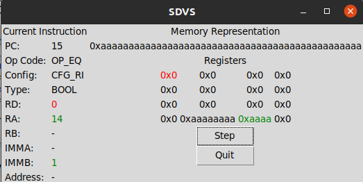

# Simple DiVine Simulator (SDVS)

The Simple DiVine Simulator (SDVS) simulates the behavior of the processing unit ([SDVU](https://github.com/QDucasse/sdvu)) and was used to co-design this processing unit and check the correct processing of instructions. It provides a way to understand instructions compiled by the compiler ([SDVC](https://github.com/QDucasse/sdvc)). The ISA is presented [here](https://github.com/QDucasse/sdvc/blob/main/docs/isa.md) and is handmade to fit the language the best. The language itself is a transformation of DiVinE to a single static assignment form (Simple DiVinE).

### Installation and Usage

The simulator uses a basic `tkinter` GUI to present instructions one by one along with the state of the memory and registers. It can be launched by specifying the binary and configuration to use through the GUI.

